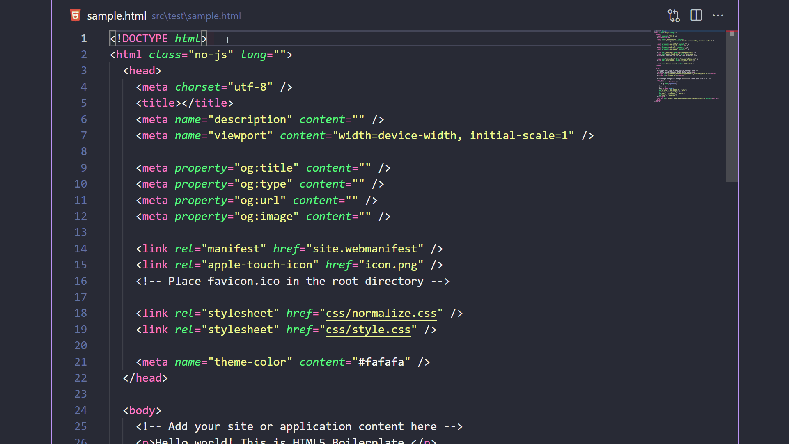
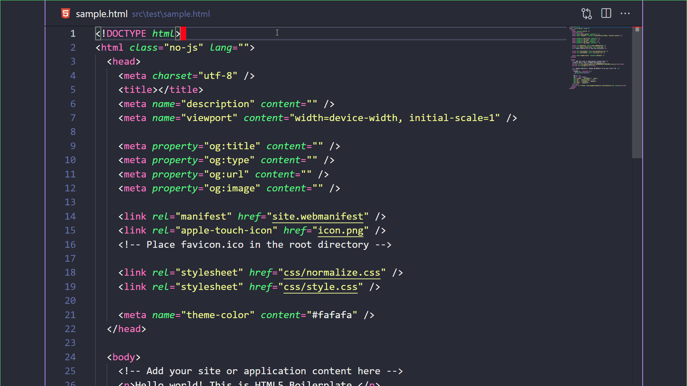
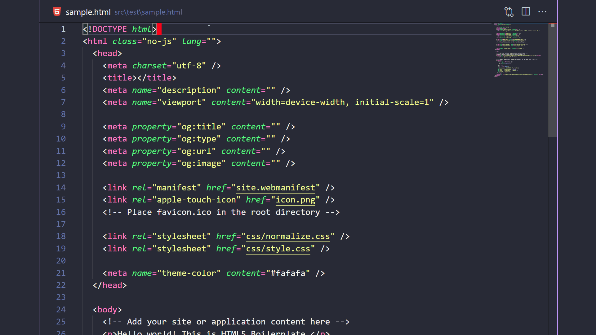
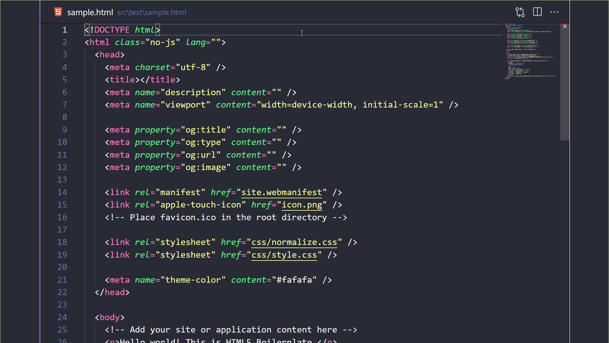

# Jump

> Jump/Select to the Start/End of a word

[✨ Install Via Marketplace ✨](https://marketplace.visualstudio.com/items?itemName=wenfangdu.jump)

## Commands

- `Jump to the Start of a word`
- `Jump to the End of a word`
- `Select to the Start of a word`
- `Select to the End of a word`
- `Exit jump mode`

## Demos

- `Jump to the Start of a word`

  

- `Jump to the End of a word`

  

- `Select to the Start of a word`

  

- `Select to the End of a word`

  

- `Exit jump mode`

  

## Credits

This extension is based on [Brad Bit](https://github.com/krnik)'s [fork](https://github.com/krnik/vscode-jumpy) of [Jumpy](https://github.com/wmaurer/vscode-jumpy), a huge thanks to the creators!
